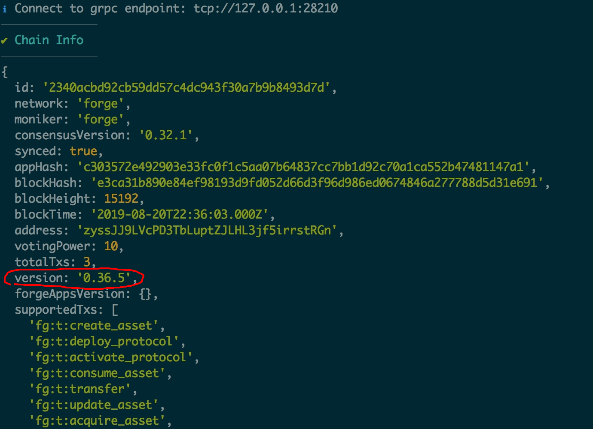
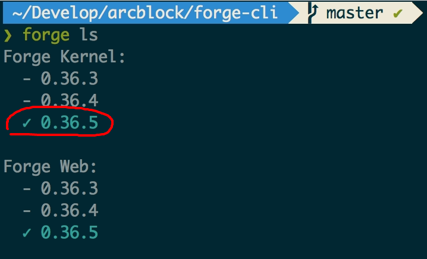
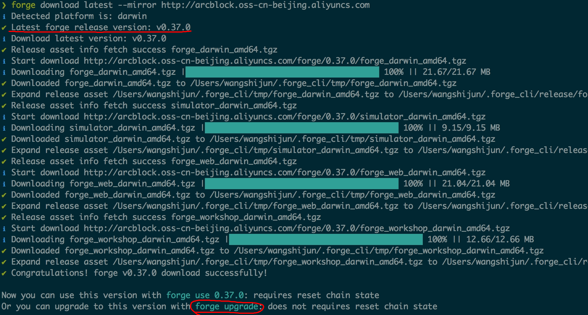
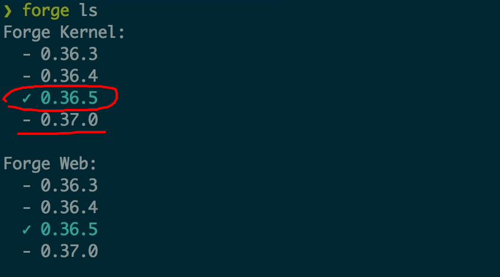
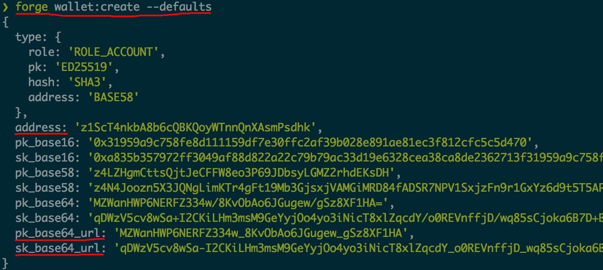
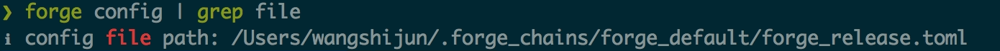
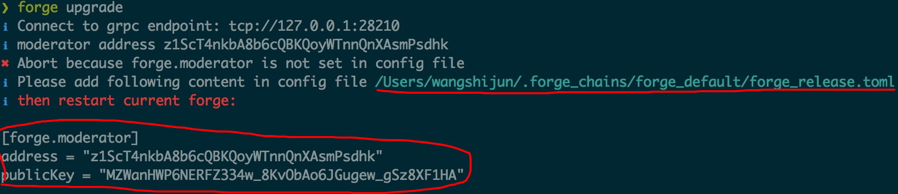

在上一篇文章[如何获取最新版的 Forge](/tutorials/hard-upgrade)中我们介绍了如何进行 Forge 链的硬升级（需要重置本地链的状态），硬升级的做法在开发环境下比较方便，相当于清空数据库的记录。

而有些时候，可能你的测试链跑了一段时间，上面产生了不少测试数据，再生成这些测试数据可能费时费力，你既希望升级到最新版的 Forge，又希望保留之前启动过的链的状态，鱼与熊掌可以兼得么？

答案是**肯定的**，接下来我们来讨论具体的实施步骤。

在介绍升级步骤之前，我们有必要再次强调下链升级在不同上下文的区别：

- 在开发环境我们可以毫无顾虑的进行链的重置、升级、启停，因为你不会影响到其他人或者用户
- 在生产环境，因为整个区块链是分布式的网络，升级的动作需要有链的社区来决定，而升级的结果需要在整条链的所有节点间同步

本文探讨的是前面一种情况，即开发环境下的具体做法。

## 准备工作

Forge CLI 是官方推荐的管理本地 Forge 链、节点的命令行工具，建议定期根据提示升级 [Forge CLI](https://github.com/ArcBlock/forge-cli) 到最新版本：`npm install -g @arcblock/forge-cli`。

## 了解 Forge 最新版本

你读到这篇文章时，已经发布的最新的 Forge 版本是：。

## 了解本地 Forge 版本

如果你想知道本地已经启动链的最新版本，直接运行：`forge status`，得到如下执行结果：



其中红色圈圈中的版本就是当前链所使用的版本，我本地链的版本是 `v0.36.5`。

当然，你也可以执行：`forge ls`，得到如下执行结果：



其中红框圈出的版本也是当前连使用的版本，`forge ls` 会列出本地已经下载过的所有可使用的 Forge 版本，并把当前使用的版本高亮出来。

升级的前提是我们本地使用的版本和远程的最新版本不同，如果两个版本相同的话，你可以到此打住啦，哈哈！

## 下载 Forge 最新版

比如如果我们把本地链从 `v0.36.5` 升级到 `v0.37.0`，我们需要先把 `v0.37.0` 所需要的组件下载下来：

```shell
forge download latest

# 中国用户
forge download latest --mirror http://arcblock.oss-cn-beijing.aliyuncs.com
```




可能有人会问，`forge download` 和 `forge install` 有啥区别？两者都会从我们的镜像下载指定版本的 Forge，不同点在于 `forge download` 只会下载，而 `forge install` 下载完之后会把本地的 Forge 版本切换到刚下载的版本。我们在硬升级的时候用的是 `forge install`。

怎么确定有没有切换本地当前使用的 Forge 版本？再次执行 `forge ls`：



## 配置链管理员

对于区块链来说，所使用软件的版本其实相当于安装在电脑硬件上的操作系统，如果要升级操作系统的版本，我们要输入管理员密码、把操作系统停下来、重新启动完成升级，如果你经历过操作系统的升级，Forge 链的升级就很好理解。

首先，我们需要给链配置 1 个管理员（moderator，本意是协调员，因为区块链本身需要在多节点，在多节点间达成共识自然需要协调员），而任何能够修改链状态的实体本质都是一个钱包，即公私钥对，对于没有配置过链管理员的同学，需要先用 `forge wallet:create --defaults` 来生成一个管理员钱包，并且保存好钱包私钥。



为了后续方便，我们先把链管理员私钥配置到环境变量里面，把下面这样加到你的 `~/.bashrc` 或者 `~/.zshrc` 里面（记得把私钥换成你生成的那个）：

```shell
export FORGE_MODERATOR_SK="qDWzV5cv8wSa-I2CKiLHm3msM9GeYyjOo4yo3iNicT8xlZqcdY_o0REVnffjD_wq85sCjoka6B7D-BLPxcXUcA"
```

> 如何确保你正确把管理员私钥导出到了环境变量里面？直接执行 `echo $FORGE_MODERATOR_SK`，如果有结果输出，说明配置正确。

接下来我们需要把链管理员信息添加到 Forge 的配置里面：

- 如果你使用的是 Forge CLI v0.36.0 以下的版本，并且按本文操作时没有升级到最新版，你的配置文件在：`~/.forge_release/forge_release.toml`
- 如果你使用的是 Forge CLI v0.36.0 及以上版本，你的配置文件在：`~/.forge_chains/forge_default/forge_release.toml`

当然，我们有更简单的方式，直接获取 Forge 链配置文件的路径：`forge config | grep file`



需要把什么内容添加到 Forge 的配置文件里呢？我们不妨直接运行 `forge upgrade` 试试：



可以看到，Forge CLI 提示我们配置文件里面没有管理员相关的配置，并且提示我们要把什么内容添加进去：

```toml
[forge.moderator]
address = "z1ScT4nkbA8b6cQBKQoyWTnnQnXAsmPsdhk"
publicKey = "MZWanHWP6NERFZ334w_8KvObAo6JGugew_gSz8XF1HA"
```

打开 Forge CLI 给出的配置文件路径，把上面的配置追加到文件的末尾，保存后退出。

## 开始升级

再次运行：`forge upgrade`，

## 验证升级


## 链升级的时候究竟发生了什么？
